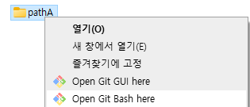
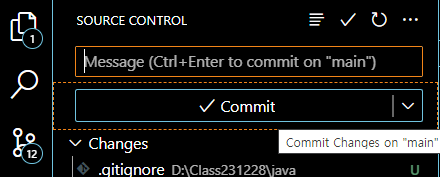
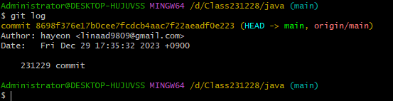

## git 버전 관리 

### git 설치
* [git-scm 다운로드](https://git-scm.com/)

### github 원격 저장소 사용하기

* [github 계정만들기](https://github.com/)

#### 로컬 저장소 초기화

1. git bash 열기

    로컬 저장소 마우스 오른쪽 클릭 > Open Git Bash 

    

1. Class231228 - java 폴더 초기화

    $ git init

1. git 사용자 이메일 설정

    $ git config --global user.email "자신의 이메일"

1. git 사용자 이름 설정

    $ git config --global user.name "자신의 이름"

1. git 사용자 이메일 확인

    $ git config user.email

#### 로컬 저장소를 원격 저장소에 연결

1. 원격 저장소에 연결

    $ git remote add origin 자신의 원격 저장소의 주소

1. 원격 저장소 상태 확인

    $ git remote -v

#### 로컬 저장소 커밋

* 파일의 변경점을 관리하기 위한 기록입니다.
* git 명령어와 vs code 메뉴를 사용할 수 있습니다.
* 편의상 vs code 메뉴를 활용해 커밋 했습니다.
    - Changes 항목 아래에는 commit 대상이 되는 파일들이 보입니다.
    - 그 파일들 중에서 원하는 파일들으 선택해서 + 아이콘을 선택하여
    Stage 항목에 올립니다.
    - Commit 버튼 클릭 전 커밋 메시지를 작성해야 합니다.

#### 원격 저장소로 Push
* Stage 로 올린 파일들을 원격 저장소로 보내 저장합니다.

    $ git push origin main

    - 로컬 저장소 mian 에 커밋된 파일들을 원격 저장소 origin 으로 push 하는 명령입니다.
    - push 를 처음 할 때는 github 인증 절차 화면으로 자동 이동 합니다. 버튼 클릭!!

* 원격 저장소를 새로 고침하면 커밋한 파일들의 목록을 확인할 수 있습니다.

* 커밋 히스토리를 확인합니다

    $ git log
    
    

